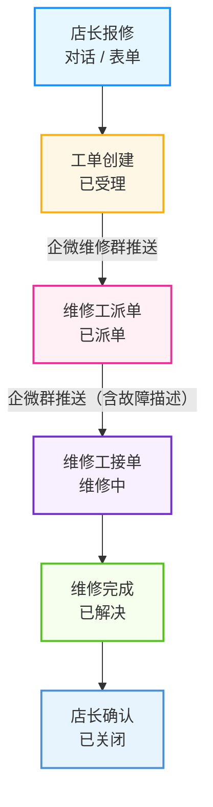

<div align="center">

# 🏪 连锁门店运营智能助手 Agent

**Store Operations Intelligent Assistant**

基于自研 Agent 状态机 + RAG + Function Calling 的门店运营全流程智能助手

[](https://www.python.org/)
[](https://fastapi.tiangolo.com/)
[](https://www.mysql.com/)
[](https://redis.io/)
[](https://www.docker.com/)
[](LICENSE)
[](https://www.deepseek.com/)

</div>

---

## 🌐 在线演示

| 页面 | 地址 |
|---|---|
| 🎨 前端页面 | http://47.98.122.252 |
| 📖 API 文档 | http://47.98.122.252/docs |
| 💚 健康检查 | http://47.98.122.252/healthz |

> 💡 演示服务器为 **2核2G 轻量部署**（MySQL + Redis + 内存向量库），LLM 在线模式已启用。

---

## 📑 目录

<details>
<summary><strong>点击展开/收起目录</strong></summary>

- [✨ 核心功能](#-核心功能)
- [🏗️ 技术架构](#️-技术架构)
- [📊 性能指标](#-性能指标)
- [📝 工单闭环流程](#-工单闭环流程)
- [🔄 数据流全景](#-数据流全景)
- [👥 角色分工](#-角色分工)
- [🚀 快速开始](#-快速开始)
- [📁 项目结构](#-项目结构)
- [🗄️ 主数据管理](#️-主数据管理)
- [📚 RAG 知识库管理后台](#-rag-知识库管理后台)
- [🔧 配置说明](#-配置说明)
- [🐳 Docker 部署](#-docker-部署)
- [📄 License](#-license)

</details>

---

## ✨ 核心功能

| 功能 | 说明 |
|---|---|
| 💬 **智能对话** | 自然语言提问，自动识别意图（报修/库存/促销/知识问答/转人工） |
| 🔧 **报修工单** | 对话式报修，自动建单，状态机流转（已受理→已派单→维修中→已解决→已关闭） |
| 📦 **库存查询** | 实时查询门店物料库存，低于补货线自动提醒 |
| 🎁 **促销校验** | 核对促销活动规则、有效期、适用范围 |
| 📚 **知识检索** | RAG 检索门店运营 SOP，支持口语化提问（同义词扩展 + 多路检索 + 重排） |
| 🖥️ **知识库管理后台** | Vue 3 + Element Plus 可视化管理文档（上传/编辑/删除/分类），一键重建向量索引 |
| 🔔 **监控告警** | 错误率/P95 延迟超阈值自动飞书告警，Prometheus 指标暴露 |
| 📱 **网页前端** | 三标签页（对话/报修/告警），响应式设计，手机浏览器直接用 |
| 🏢 **企业微信** | 群机器人主动推送 + 回调被动回复，维修工群内指令推进工单状态 |

---

## 🏗️ 技术架构

```mermaid
flowchart TB
    subgraph Frontend["🎨 前端层（HTML/CSS/JS）"]
        A1["对话页"]
        A2["报修页"]
        A3["告警监控页"]
    end

    subgraph APILayer["⚡ FastAPI（REST + SSE 流式）"]
        B["API 网关"]
    end

    subgraph AgentLayer["🧠 自研 Agent 状态机（4节点条件路由）"]
        C1["🎯 意图识别节点"]
        C2["📚 知识检索节点<br/>RAG: 向量+关键词RRF融合+重排"]
        C3["🔧 工具执行节点<br/>报修/库存/促销 Function Calling"]
        C4["📤 输出节点"]
        C1 --> C2 --> C3 --> C4
    end

    subgraph StorageLayer["💾 存储层"]
        D1["🐬 MySQL<br/>工单/日志"]
        D2["🟥 Redis<br/>会话缓存"]
        D3["📊 向量库<br/>Milvus / 内存降级"]
    end

    subgraph ExternalLayer["🌐 外部服务"]
        E1["🤖 DeepSeek LLM"]
        E2["🔢 硅基流动 Embedding"]
        E3["📢 飞书 / 企微"]
    end

    Frontend -->|"Nginx 反代（80端口，支持SSE）"| APILayer
    APILayer --> AgentLayer
    AgentLayer --> StorageLayer
    StorageLayer --> ExternalLayer

    style Frontend fill:#e8f4fd,stroke:#4a90d9,stroke-width:2px
    style APILayer fill:#e6f7f0,stroke:#52c41a,stroke-width:2px
    style AgentLayer fill:#fff7e6,stroke:#faad14,stroke-width:2px
    style StorageLayer fill:#f9f0ff,stroke:#722ed1,stroke-width:2px
    style ExternalLayer fill:#fff1f0,stroke:#ea6668,stroke-width:2px
```



---

## 📊 性能指标

| 指标 | 数值 | 说明 |
|---|---|---|
| 🎯 召回率@3 | **98.75%** | 120 条评测集，离线哈希向量模式 |
| 🎯 意图准确率 | **100%** | 5 类意图分类 |
| ✅ 任务完成率 | **100%** | 工具调用 + 状态机流转 |
| 🚫 幻觉率 | **0%** | RAG 检索 + 工具调用，无自由生成 |
| 🧪 单元测试 | **47 passed** | 33 核心 + 14 主数据管理 |
| 🔄 工单状态机 | **5 状态** | 不可跳级/回退，关闭需店长确认 |

---

## 📝 工单闭环流程



> 💡 维修工可在企微群内回复「RX单号 已派单/维修中/已解决」自动推进状态，或在网页前端操作。

---

## 🔄 数据流全景

### 📊 7 类业务数据的完整生命周期

| 数据类型 | 来源（输入） | 存储位置 | 出口（消费） | 更新方式 |
|---|---|---|---|---|
| 🔧 **报修工单** | 店长对话报修 / 网页表单 / API | MySQL `repair_orders` | 企微群推送 / 网页工单列表 / API | 系统自动流转（状态机） |
| 📦 **物料库存** | CSV导入 / ERP同步 / 手动调整 / API | MySQL `inventory` | 对话查询回答 / API / 补货提醒 | 定时同步脚本 + CSV + API |
| 🎁 **促销政策** | CSV导入 / API手动录入 | MySQL `promotions` | 对话校验回答 / API / 前端展示 | CSV + API + 每天自动过期检查 |
| 🏪 **门店信息** | CSV导入 / API手动录入 | MySQL `stores` | 对话门店校验 / API / 前端展示 | CSV + API |
| 🖥️ **设备信息** | CSV导入 / API手动录入 | MySQL `devices` | 报修设备校验 / API / 前端展示 | CSV + API |
| 👤 **员工信息** | CSV导入 / API手动录入 | MySQL `staff` | API / 接单人识别（可选扩展） | CSV + API |
| 📚 **知识库/SOP** | Markdown文档（`data/raw_docs/`） | `data/index.json`（向量索引） | RAG检索回答 / 对话上下文 | 改文档 → 重建索引 → 重启 |

### ⚙️ 3 类系统数据（自动管理，无需手动）

| 数据类型 | 存储位置 | 更新方式 |
|---|---|---|
| 💬 **对话日志** | MySQL `chat_logs` | 系统自动记录 |
| 📝 **会话缓存** | Redis（连不上降级内存） | 系统自动（过期自动清理） |
| 🔐 **配置/密钥** | `deploy/.env` | 改 `.env` → 重启服务 |

### 📤 数据消费方式（3 种出口）

| 出口方式 | 说明 | 示例 |
|---|---|---|
| 💬 **智能对话** | 店长/店员自然语言提问，Agent自动检索知识库+调用工具返回答案 | "可乐杯还有多少库存" → 查 inventory 表 → 返回库存数量 |
| 🎨 **网页前端** | 三标签页（对话/报修/告警），可视化展示数据 | 报修工单列表、库存状态、告警指标 |
| 🌐 **REST API** | 标准 HTTP 接口，可对接管理后台、移动端、第三方系统 | `GET /api/repairs`、`POST /api/inventory` |

---

## 👥 角色分工

| 角色 | 日常操作 | 使用界面 | 技术要求 |
|---|---|---|---|
| 👤 **店员/店长** | 提问、报修、查库存、查促销 | 网页前端 / 企业微信 | 零技术，会打字就行 |
| 🔧 **维修工** | 接单、推进工单状态、查看报修详情 | 企业微信群 / 网页前端 | 零技术 |
| 📊 **运营人员** | 维护主数据、更新 SOP 文档、管理促销活动 | Excel + 命令行脚本 / API | 会用 Excel，会敲命令 |
| ⚙️ **开发者/运维** | 部署服务、导入数据、配置定时任务、排查问题 | 命令行 / Docker / 代码 | 需要技术背景 |
| 🔐 **系统管理员** | 配置密钥、管理权限、监控告警 | `.env` 配置 / 监控面板 | 需要技术背景 |

### 📋 数据维护责任表

| 数据类型 | 谁来维护 | 怎么维护 | 频率 |
|---|---|---|---|
| 📚 知识库/SOP | 运营人员 | 改 Markdown → 重建索引 | 政策变更时 |
| 📦 物料库存 | 系统自动 + 运营 | ERP 定时同步 + 手动修正 | 每 10 分钟 |
| 🎁 促销政策 | 运营人员 | CSV 导入 / API | 活动上线时 |
| 🏪 门店信息 | 运营人员 | CSV 导入 / API | 开店/闭店时 |
| 🖥️ 设备信息 | 运营人员 | CSV 导入 / API | 采购/报废时 |
| 👤 员工信息 | 运营人员 | CSV 导入 / API | 入职/离职时 |
| 🔧 报修工单 | 系统自动 | 状态机自动流转 | 实时 |

---

## 🚀 快速开始（离线模式，无需任何 Key）

```bash
# 1. 克隆项目
git clone <your-repo-url>
cd project1_store_agent

# 2. 创建虚拟环境并安装依赖
python -m venv .venv
.venv\Scripts\activate  # Windows
# source .venv/bin/activate  # Linux/Mac
pip install -r requirements.txt

# 3. 生成样例文档并构建索引
python scripts/gen_docs.py
python scripts/build_index.py

# 4. 跑单元测试
pytest tests -q

# 5. 命令行模拟对话
python scripts/simulate_client.py

# 6. 启动 HTTP 服务
uvicorn app.main:app --reload --port 8000
```

访问 http://localhost:8000 查看前端页面，http://localhost:8000/docs 查看 API 文档。

---

## 📁 项目结构

```
project1_store_agent/
├── app/                          # 🎯 应用主目录
│   ├── main.py                   # FastAPI 入口（REST + SSE）
│   ├── config.py                 # ⚙️ 配置中心（.env 读取）
│   ├── db.py                     # 💾 MySQL/SQLite 持久化 + 7张表CRUD + 工单状态机
│   ├── schemas.py                # 📊 Pydantic 请求/响应模型
│   ├── session.py                # 📝 Redis/内存会话管理
│   ├── wecom.py                  # 🏢 企业微信接入（回调 + 机器人推送）
│   ├── monitor.py                # 🔔 监控告警 + Prometheus 指标
│   ├── llm/client.py             # 🤖 LLM 客户端（在线/离线双模式）
│   ├── agent/                    # 🧠 Agent 核心
│   │   ├── graph.py              # Agent 状态机编排（LangGraph/手动执行器双模式）
│   │   ├── nodes.py              # 意图识别/检索/工具/输出 4 节点
│   │   ├── state.py              # Agent 状态定义
│   │   └── tools.py              # 报修/库存/促销 3 个工具
│   ├── rag/                      # 📚 RAG 检索模块
│   │   ├── chunker.py            # 结构化分块
│   │   ├── embedder.py           # 向量化（API/离线哈希）
│   │   ├── vector_store.py       # Milvus/内存向量库
│   │   ├── query_rewriter.py     # 查询重写/同义词扩展
│   │   ├── reranker.py           # 重排器
│   │   └── retriever.py          # 多路检索 RRF 融合
│   └── eval/                     # 📈 评测集 + 评测脚本
├── data/                         # 📊 数据目录
│   ├── gen_docs.py               # 生成 300+ 份样例门店文档
│   ├── raw_docs/                 # 原始运营文档（Markdown）
│   ├── templates/                # 数据导入模板（CSV，含示例数据）
│   │   ├── stores.csv            # 门店模板
│   │   ├── devices.csv           # 设备模板
│   │   ├── staff.csv             # 员工模板
│   │   ├── promotions.csv        # 促销模板
│   │   └── inventory.csv         # 库存模板
│   ├── index.json                # 向量索引（build_index.py 生成）
│   └── app.db                    # SQLite 数据库（MySQL 不可用时降级）
├── deploy/                       # 🚀 部署相关
│   ├── Dockerfile                # 应用镜像
│   ├── docker-compose.yml        # 完整版（Milvus + MySQL + Redis + Nginx）
│   ├── docker-compose.lite.yml   # 轻量版（MySQL + Redis + 内存向量库，2核2G可用）
│   ├── nginx.conf                # Nginx 反代配置（SSE 支持）
│   └── html/                     # 🎨 前端静态页面
├── scripts/                      # 🔧 运维脚本
│   ├── gen_docs.py               # 生成样例运营文档
│   ├── build_index.py            # 构建向量索引
│   ├── init_db.py                # 初始化数据库
│   ├── init_master_data.py       # 初始化主数据（库存/促销/门店/设备/员工）
│   ├── simulate_client.py        # 命令行模拟对话
│   ├── sync_inventory.py         # 库存同步（模拟ERP/CSV导入/手动调整）
│   ├── import_stores.py          # 门店信息批量导入（Excel/CSV）
│   ├── import_devices.py         # 设备台账批量导入（Excel/CSV）
│   ├── import_staff.py           # 员工信息批量导入（Excel/CSV）
│   ├── import_promotions.py      # 促销政策批量导入（Excel/CSV）
│   └── check_promotions.py       # 促销活动自动过期检查
├── tests/                        # 🧪 单元测试（47 passed）
├── docs/design.md                # 📚 架构设计文档
├── requirements.txt              # 📦 Python 依赖
├── .env.example                  # ⚙️ 环境变量模板（Key 已脱敏）
├── .gitignore                    # 🚫 Git 忽略文件
├── pytest.ini                    # ⚙️ pytest 配置
└── README.md                     # 📖 项目说明
```

---

## 🗄️ 主数据管理（5 张表 + CSV 导入 + REST API）

> ⚠️ **以下是运营人员/开发者视角的操作**，用于初始化业务数据。店员/店长日常使用不需要做这些。

系统内置 5 张主数据表，支持 **Excel/CSV 批量导入** + **REST API 管理**，无需对接外部系统即可快速上线。

### 📋 5 张主数据表

| 数据表 | 用途 | 初始化脚本 |
|---|---|---|
| `inventory` | 门店物料库存（支持按门店分库存） | `scripts/init_master_data.py` |
| `promotions` | 促销政策（支持有效期/状态管理） | 同上 |
| `stores` | 门店主数据（地址/电话/店长/状态） | 同上 |
| `devices` | 设备清单（品牌/型号/保修/状态） | 同上 |
| `staff` | 员工信息（角色/电话/所属门店） | 同上 |

### 📥 CSV 批量导入

`data/templates/` 目录提供了 5 个 CSV 模板（含示例数据），直接用 Excel 打开编辑即可：

```bash
# 导入门店信息
python scripts/import_stores.py data/templates/stores.csv

# 导入设备台账
python scripts/import_devices.py data/templates/devices.csv

# 导入员工信息
python scripts/import_staff.py data/templates/staff.csv

# 导入促销政策
python scripts/import_promotions.py data/templates/promotions.csv

# 导入物料库存
python scripts/sync_inventory.py --import data/templates/inventory.csv
```

> 💡 所有导入脚本支持中英文列名自动识别，CSV 用 UTF-8 编码（Excel 另存为 CSV UTF-8）。

### 📦 库存实时同步

```bash
# 模拟 ERP 同步（随机波动，演示用）
python scripts/sync_inventory.py

# 手动设置某物料库存
python scripts/sync_inventory.py --set S001 可乐杯 500

# 库存增减（入库/出库）
python scripts/sync_inventory.py --delta S001 可乐杯 -100
```

生产环境将 `sync_inventory.py` 中的模拟逻辑替换为真实 ERP API 调用，配置为定时任务（每 10 分钟一次）即可实现实时库存同步。

### 🎁 促销自动过期

```bash
# 检查并自动标记过期活动（建议每天凌晨定时运行）
python scripts/check_promotions.py

# 预览模式（只检查不修改）
python scripts/check_promotions.py --dry-run
```

### 🌐 管理接口（REST API）

所有主数据均提供 CRUD 接口，可对接管理后台：

```
GET    /api/inventory?store_id=S001    # 库存列表
POST   /api/inventory                    # 新增/更新库存

GET    /api/promotions                   # 促销列表
POST   /api/promotions                   # 新增/更新促销

GET    /api/stores                       # 门店列表
POST   /api/stores                       # 新增/更新门店

GET    /api/devices?store_id=S001       # 设备清单
POST   /api/devices                      # 新增/更新设备

GET    /api/staff?role=维修工            # 员工列表
POST   /api/staff                        # 新增/更新员工
```

### ⏰ 定时任务配置（Linux crontab）

```bash
# 编辑 crontab
crontab -e

# 粘贴以下内容：
*/10 * * * * cd /opt/project1_store_agent && python scripts/sync_inventory.py >> /var/log/sync_inventory.log 2>&1
0 2 * * * cd /opt/project1_store_agent && python scripts/check_promotions.py >> /var/log/check_promotions.log 2>&1
```

---

## 📚 RAG 知识库管理后台

基于 **Vue 3 + Element Plus** 的可视化知识库管理界面，对接 FastAPI + Milvus（含内存降级模式），支持文档的上传、编辑、删除、分类管理和一键重建向量索引。

### ✨ 功能特性

| 功能 | 说明 |
|---|---|
| 📊 **仪表盘** | 文档总数、Chunk 数、分类分布、向量引擎状态一目了然 |
| 📁 **文档管理** | 列表展示、关键词搜索、分类筛选、分页浏览 |
| ⬆️ **文档上传** | 支持 `.md` / `.txt` / `.pdf` 格式，拖拽上传，自动识别分类 |
| ✏️ **在线编辑** | Markdown 内容编辑器，可修改标题、分类和正文内容 |
| 🗑️ **文档删除** | 一键删除文档及元数据，删除后提示重建索引 |
| 🔄 **索引重建** | 遍历所有文档 → 分块 → 向量化 → 入库 → 持久化，进度可视化 |
| 🏷️ **自动分类** | 根据文件名和内容自动识别 12 类文档（设备报修/收银操作/客诉处理等） |

### 🛠️ 技术栈

| 层级 | 技术 |
|---|---|
| 前端框架 | Vue 3 + Vite |
| UI 组件库 | Element Plus |
| 路由 | Vue Router 4 |
| HTTP 客户端 | Axios |
| 后端 | FastAPI |
| 向量库 | Milvus（生产）/ 内存向量库（演示） |

### 📄 后端 API 接口

| 方法 | 路径 | 说明 |
|---|---|---|
| GET | `/api/kb/documents` | 文档列表（分页/搜索/分类筛选） |
| GET | `/api/kb/documents/{id}` | 文档详情和内容 |
| POST | `/api/kb/upload` | 上传文档（multipart/form-data） |
| PUT | `/api/kb/documents/{id}` | 更新文档标题/分类/内容 |
| DELETE | `/api/kb/documents/{id}` | 删除文档 |
| POST | `/api/kb/rebuild` | 重建向量索引 |
| GET | `/api/kb/stats` | 知识库统计信息 |
| GET | `/api/kb/categories` | 文档分类列表 |

### 🚀 快速启动

```bash
# 1. 启动后端服务
cd project1_store_agent
pip install -r requirements.txt
uvicorn app.main:app --reload --port 8000

# 2. 启动前端开发服务（新开终端）
cd kb-admin
npm install
npm run dev
```

访问 **http://localhost:5173** 进入管理后台。

### 📦 构建生产版本

```bash
cd kb-admin
npm run build
```

构建产物在 `dist/` 目录，可部署到 Nginx 或由 FastAPI 静态文件托管。

### 📁 项目结构

```
kb-admin/
├── index.html              # 入口 HTML
├── package.json            # 依赖配置
├── vite.config.js          # Vite 配置（含 API 代理）
├── README.md               # 前端说明文档
└── src/
    ├── main.js             # 应用入口
    ├── App.vue             # 根组件（侧边栏布局）
    ├── router.js           # 路由配置
    ├── api/
    │   └── index.js        # API 封装（Axios）
    └── views/
        ├── Dashboard.vue       # 仪表盘（统计卡片 + 分类分布）
        ├── DocumentList.vue    # 文档列表（搜索/筛选/上传/删除）
        ├── DocumentEdit.vue    # 文档编辑（Markdown 编辑器）
        └── IndexManage.vue     # 索引管理（一键重建 + 状态监控）
```

### ⚠️ 注意事项

- 上传或编辑文档后，**必须在「索引管理」页面点击「重建向量索引」**，新内容才能在对话中被检索到
- 内存向量库模式下，索引持久化到 `data/index.json`，服务重启自动加载
- Milvus 模式下，索引存储在 Milvus 的 `store_chunks` 集合中
- 支持的文档格式：`.md`（Markdown）、`.txt`（纯文本）、`.pdf`（PDF 文档，自动提取文本）

---

## 🔧 配置说明

复制 `.env.example` 为 `.env`，填写真实配置：

| 配置项 | 说明 | 可选 |
|---|---|---|
| `LLM_API_KEY` | DeepSeek API Key | 不填则离线规则模式 |
| `EMBED_API_KEY` | 硅基流动 Embedding Key | 不填则离线哈希向量 |
| `MYSQL_*` | MySQL 连接配置 | 连不上自动降级 SQLite |
| `REDIS_*` | Redis 连接配置 | 连不上自动降级内存会话 |
| `MILVUS_*` | Milvus 向量库配置 | 连不上自动降级内存向量库 |
| `FEISHU_WEBHOOK` | 飞书群机器人 Webhook | 不填则跳过告警推送 |
| `WECOM_WEBHOOK` | 企业微信群机器人 Webhook | 不填则跳过工单推送 |

---

## 🐳 Docker 部署

### 🪶 轻量版（推荐，2核2G 服务器可用）

```bash
cd deploy
cp ../.env.example .env  # 填写真实配置
docker compose -f docker-compose.lite.yml up -d --build
```

启动 4 个容器：MySQL + Redis + App + Nginx，向量库自动降级内存模式。

### 🚀 完整版（含 Milvus 向量库）

```bash
cd deploy
cp ../.env.example .env
docker compose up -d --build
```

启动 7 个容器：etcd + MinIO + Milvus + MySQL + Redis + App + Nginx。

---

## 📄 License

[MIT](LICENSE)

---

<div align="center">

**如果这个项目对你有帮助，欢迎给个 ⭐ Star 支持！**

</div>
